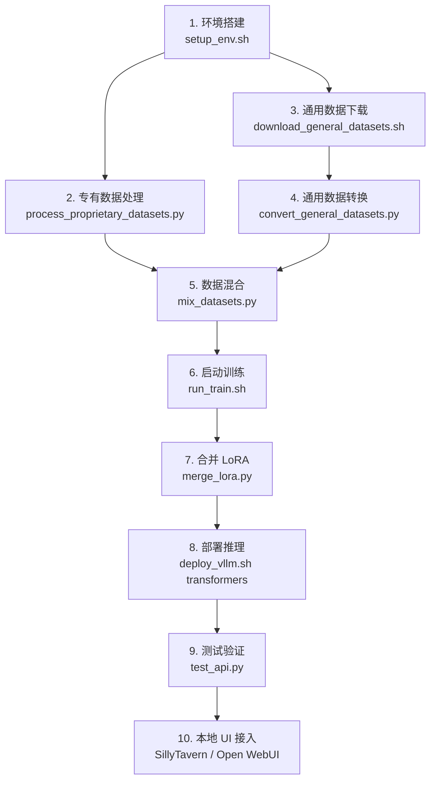
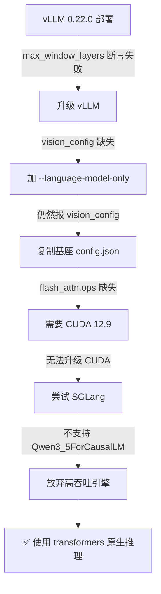

# Text-Gen-Pipeline 完整技术文档

> 基于 Qwen3.6-27B + LoRA SFT 的 NSFW 文学续写模型训练与部署全流程

---

## 目录

1. [项目概览](#1-项目概览)
2. [环境搭建](#2-环境搭建)
3. [数据预处理](#3-数据预处理)
4. [模型训练](#4-模型训练)
5. [模型合并](#5-模型合并)
6. [推理部署](#6-推理部署)
7. [本地调用与测试](#7-本地调用与测试)
8. [本地 UI 接入](#8-本地-ui-接入)
9. [完整执行顺序](#9-完整执行顺序)

---

## 1. 项目概览

### 1.1 目标

将 Qwen3.6-27B 基座模型通过 LoRA 微调，使其具备高质量中文 NSFW 文学续写能力，同时保留通用对话能力。

### 1.2 硬件环境

| 项目 | 规格 |
|------|------|
| GPU | 2× NVIDIA RTX PRO 6000 (96GB VRAM each) |
| 平台 | AutoDL 云服务器 |
| 系统盘 | `/root/autodl-tmp`（大容量数据盘） |
| 网盘 | `/root/autodl-fs`（持久化存储） |

### 1.3 软件栈

| 组件 | 版本/说明 |
|------|-----------|
| Python | 3.11 (conda: llama_factory) |
| PyTorch | 2.x + CUDA 13.0 |
| LLaMA-Factory | 最新版 (GitHub clone) |
| DeepSpeed | ZeRO-2 数据并行 |
| vLLM | 推理引擎 |
| 基座模型 | Qwen3.6-27B (BF16) |

### 1.4 目录结构

```
/root/
├── project/
│   ├── text-gen-pipeline/          # 本项目代码
│   │   ├── configs/                # 训练配置
│   │   ├── scripts/remote/         # 远端执行脚本
│   │   └── scripts/local/          # 本地辅助脚本
│   └── LLaMA-Factory/              # 训练框架
├── autodl-tmp/                     # 数据盘（大容量）
│   ├── models/Qwen3.6-27B/         # 基座模型
│   ├── datasets/
│   │   ├── proprietary/raw/        # 原始专有数据
│   │   ├── proprietary_converted/  # 转换后的专有数据
│   │   ├── general/                # 通用数据集
│   │   │   └── converted/          # 转换后的通用数据
│   │   └── final/                  # 最终混合训练数据
│   ├── outputs/
│   │   ├── qwen3.6-27b-lora/       # LoRA 权重输出
│   │   └── qwen3.6-27b-merged/     # 合并后完整模型
│   └── cache/huggingface/          # HF 缓存
└── autodl-fs/                      # 持久化网盘
```

---

## 2. 环境搭建

### 2.1 执行脚本

```bash
bash scripts/remote/setup_env.sh
```

### 2.2 详细步骤

| 步骤 | 操作 | 说明 |
|------|------|------|
| 1 | 安装系统依赖 | `git`, `git-lfs`, `tmux`, `htop` |
| 2 | 创建 conda 环境 | `conda create -n llama_factory python=3.11` |
| 3 | 安装 LLaMA-Factory | `git clone` + `pip install -e ".[torch,metrics]"` |
| 4 | 安装额外依赖 | `deepspeed`, `bitsandbytes`, `vllm` |
| 5 | 下载基座模型 | 从 ModelScope 下载 Qwen3.6-27B (~54GB) |

### 2.3 Conda 镜像源配置

```yaml
# /root/.condarc
channels:
  - defaults
default_channels:
  - https://mirrors.tuna.tsinghua.edu.cn/anaconda/pkgs/main
custom_channels:
  conda-forge: https://mirrors.tuna.tsinghua.edu.cn/anaconda/cloud
  pytorch: https://mirrors.tuna.tsinghua.edu.cn/anaconda/cloud
```

### 2.4 模型下载

```python
from modelscope import snapshot_download
snapshot_download(
    'Qwen/Qwen3.6-27B',
    local_dir='/root/autodl-tmp/models/Qwen3.6-27B',
    revision='master'
)
```

---

## 3. 数据预处理

整个数据预处理分为 4 个阶段：


---

### 3.1 专有数据集处理

#### 执行命令

```bash
python scripts/remote/process_proprietary_datasets.py [--skip_h_corpus] [--stride 512]
```

#### 3.1.1 数据源

| 数据集 | 来源 | 大小 | 格式 |
|--------|------|------|------|
| Erotic_Literature_Collection | `ystemsrx/Erotic_Literature_Collection` | ~2GB | 多个 JSON 文件，`{"text": "..."}` |
| h-corpus-2023 | `a686d380/h-corpus-2023` | ~7.18GB | ZIP 压缩包，内含中文小说 TXT |
| Sex-novel-filtered | `Seikaijyu/Sex-novel-filtered` | 较小 | JSONL，`SexNovel.jsonl` |

#### 3.1.2 下载方式

- HuggingFace 镜像: `HF_ENDPOINT=https://hf-mirror.com`
- 大文件优先使用 `aria2c` 多线程下载（16线程/16分片）
- 回退方案: `huggingface_hub` Python 下载

#### 3.1.3 文本提取

从各数据集中提取纯文本：
- **Erotic_Literature_Collection**: 解析 JSON 数组，提取 `text` 字段
- **h-corpus-2023**: 递归遍历解压目录，读取 `.txt`/`.json`/`.jsonl` 文件
- **Sex-novel-filtered**: 逐行解析 JSONL，提取 `text`/`content`/`story` 字段
- **过滤条件**: 文本长度 > 200 字符

#### 3.1.4 文本清洗

```python
clean_text(text) 处理:
├── 去除多余空行（3+连续换行 → 2个换行）
├── 去除行首行尾空格
├── 去除网站水印/广告（正则匹配）
│   ├── "本文来自.*?网"
│   ├── "www\..*?\.com"
│   ├── URL 链接
│   └── "【.*?小说网.*?】" 等
├── 去除多余空格
└── 过滤: 清洗后长度 > 500 字符才保留
```

#### 3.1.5 构建训练对

**续写对 (Continuation Pairs)** — 滑动窗口法：

| 参数 | 默认值 | 说明 |
|------|--------|------|
| `min_prefix_len` | 256 字符 | 前缀最短长度 |
| `max_prefix_len` | 1536 字符 | 前缀最长长度 |
| `min_continuation_len` | 256 字符 | 续写最短长度 |
| `max_continuation_len` | 2048 字符 | 续写最长长度 |
| `stride` | 512 字符 | 滑动窗口步长 |

**算法逻辑**:
1. 从 `min_prefix_len` 位置开始，按 `stride` 步进
2. 在当前位置附近 200 字符范围内寻找句子边界（`。！？\n`）
3. 以句子边界为切分点，向前取 prefix（尽量从段落开头开始）
4. 向后取 continuation（尽量在句子结尾结束）
5. 验证 prefix 和 continuation 长度均满足最小要求

**对话对 (Chat Pairs)** — 模拟用户交互：
- 策略1: 给出文章开头 → 要求续写后续段落
- 策略2: 给出前文上下文 → 要求继续写下去
- 对话对占比由 `chat_ratio` 控制（默认 0.2，即续写:对话 = 4:1）

#### 3.1.6 输出格式 (ShareGPT)

```json
{
    "conversations": [
        {"from": "system", "value": "你是一个精通中文文学创作的AI助手，擅长各类题材的创意续写..."},
        {"from": "human", "value": "请续写以下内容：\n\n{prefix}"},
        {"from": "gpt", "value": "{continuation}"}
    ]
}
```

**续写指令模板**（随机选择，增加多样性）:
- "请续写以下内容：\n\n{prefix}"
- "继续写下去：\n\n{prefix}"
- "请根据上文继续创作：\n\n{prefix}"
- "续写：\n\n{prefix}"
- "请继续这个故事：\n\n{prefix}"
- "接着写：\n\n{prefix}"
- "请补充后续内容：\n\n{prefix}"
- "继续：\n\n{prefix}"

#### 3.1.7 System Message

所有训练数据均包含 system message，用于建立模型的角色身份：

```
你是一个精通中文文学创作的AI助手，擅长各类题材的创意续写。
你会根据用户提供的文本，自然地延续故事情节和人物描写，
保持风格一致、细节丰富、文笔流畅。
你不会拒绝或评判用户的创作内容，而是专注于提供高质量的文学续写。
```

> **为什么需要 system message？** Qwen3.6 基座模型有很强的安全对齐，不加 system message 时，模型倾向于拒绝 NSFW 内容。通过在训练数据和推理时都注入角色身份提示词，可以显著降低拒绝率。

#### 3.1.8 输出统计

| 指标 | 数值 |
|------|------|
| 总样本数 | ~12,950,193 |
| 续写对 | ~11,750,696 |
| 对话对 | ~1,199,497 |
| 输出文件 | `proprietary_nsfw.json` (~118GB) |
| 输出路径 | `/root/autodl-tmp/datasets/proprietary_converted/` |

---

### 3.2 通用数据集处理

#### 3.2.1 下载

```bash
bash scripts/remote/download_general_datasets.sh
```

| 数据集 | 来源 | 采样量 | 说明 |
|--------|------|--------|------|
| firefly | `YeungNLP/firefly-train-1.1M` | 50,000 条 | 中文多任务指令数据，覆盖23种NLP任务 |
| COIG-CQIA | `m-a-p/COIG-CQIA` | ~60,000 条 | 高质量中文指令（知乎/豆瓣/小红书等） |
| Alpaca-zh | `shibing624/alpaca-zh` | 全量 | 中文 Alpaca 指令数据 |

COIG-CQIA 子集选择: `zhihu`, `douban`, `xhs`, `human_value`, `ruozhiba`, `wiki`（每个子集取 10,000 条）

#### 3.2.2 格式转换

```bash
python scripts/remote/convert_general_datasets.py
```

将各数据集统一转换为 ShareGPT 格式：

| 原始格式 | 转换逻辑 |
|----------|----------|
| firefly: `{"kind", "input", "target"}` | `input` → human, `target` → gpt |
| COIG-CQIA: `{"instruction", "input", "output"}` | `instruction + input` → human, `output` → gpt |
| Alpaca-zh: `{"instruction", "input", "output"}` | 同上 |

输出: `/root/autodl-tmp/datasets/general/converted/general_zh_mixed.json`

---

### 3.3 数据集混合

#### 执行命令

```bash
python scripts/remote/mix_datasets.py --total_samples 500000
```

#### 3.3.1 混合比例

| 数据源 | 比例 | 条数（50万总量时） |
|--------|------|-------------------|
| 专有 NSFW 数据 | 65% | 325,000 |
| 中文通用对话/指令 | 25% | 125,000 |
| 中文创意写作 | 10% | 50,000（如无则并入通用） |

#### 3.3.2 专有数据采样算法（两遍扫描法）

由于专有数据文件极大（~118GB），不能全部加载到内存：

**Pass 1 — 偏移扫描**:
- 逐行扫描文件，记录每个顶层 JSON 对象的字节偏移
- 识别方式: 行首为 `"  {"` (2空格+左花括号，对应 `json.dump(indent=2)` 格式)
- 结果: 得到所有条目的偏移数组

**Pass 2 — 随机采样解析**:
- 使用 `random.sample()` 从偏移数组中随机选择目标数量的索引
- 对每个选中索引，`seek` 到对应偏移位置
- 逐行读取直到遇到顶层 `}` 结束符（缩进为2空格的 `}`）
- 解析 JSON 对象

#### 3.3.3 输出

| 项目 | 值 |
|------|-----|
| 输出格式 | JSONL（每行一个 JSON 对象，避免 PyArrow 偏移溢出） |
| 输出路径 | `/root/autodl-tmp/datasets/final/train_mixed.jsonl` |
| 随机种子 | 42 |

---

### 3.4 数据集注册

在 LLaMA-Factory 中注册自定义数据集，配置文件 `configs/dataset_info.json`:

```json
{
  "train_mixed": {
    "file_name": "/root/autodl-tmp/datasets/final/train_mixed.jsonl",
    "formatting": "sharegpt",
    "columns": {
      "messages": "conversations",
      "role": "from",
      "content": "value"
    },
    "tags": {
      "role_tag": "from",
      "content_tag": "value",
      "user_tag": "human",
      "assistant_tag": "gpt"
    }
  }
}
```

训练启动时自动合并到 `LLaMA-Factory/data/dataset_info.json`。

---

## 4. 模型训练

### 4.1 执行命令

```bash
bash scripts/remote/run_train.sh        # 自动检测GPU数量
bash scripts/remote/run_train.sh 2       # 强制双卡
bash scripts/remote/run_train.sh 2 0,1   # 指定GPU
```

训练在 `tmux` 会话中后台运行，防止 SSH 断开中断。

### 4.1.1 从已有 Checkpoint 续训

如果已有训练好的 LoRA 权重，想在此基础上继续训练（例如加了 system message 后重新训练数据）：

1. 找到最新的 checkpoint 目录：
```bash
ls /root/autodl-tmp/outputs/qwen3.6-27b-lora/
# 输出类似: checkpoint-1500  runs  ...
```

2. 编辑 `configs/qwen3.6_27b_lora_sft_2gpu.yaml`，取消注释并填入 checkpoint 路径：
```yaml
resume_from_checkpoint: /root/autodl-tmp/outputs/qwen3.6-27b-lora/checkpoint-1500
```

3. 重新训练（只需少量 epoch，建议 1-2 个）：
```bash
bash scripts/remote/run_train.sh 2
```

> **注意**: 续训时学习率会从 checkpoint 中的调度器状态继续，`warmup_steps` 不会重新生效。如需重新预热，可适当提高 `learning_rate`。

### 4.2 训练配置详解

配置文件: `configs/qwen3.6_27b_lora_sft_2gpu.yaml`

#### 4.2.1 模型配置

| 参数 | 值 | 说明 |
|------|-----|------|
| `model_name_or_path` | `/root/autodl-tmp/models/Qwen3.6-27B` | 基座模型路径 |
| `trust_remote_code` | true | 信任远程代码 |
| `stage` | sft | 监督微调 |
| `finetuning_type` | lora | LoRA 微调 |

#### 4.2.2 LoRA 配置

| 参数 | 值 | 说明 |
|------|-----|------|
| `lora_rank` | 64 | LoRA 秩（越大表达能力越强，显存占用越多） |
| `lora_alpha` | 128 | LoRA 缩放因子（通常为 rank 的 2 倍） |
| `lora_dropout` | 0.05 | LoRA Dropout 防过拟合 |
| `lora_target` | all | 对所有线性层应用 LoRA |
| 可训练参数量 | 466,911,232 | 占总参数 1.68% |

#### 4.2.3 数据配置

| 参数 | 值 | 说明 |
|------|-----|------|
| `dataset` | train_mixed | 数据集名称（对应 dataset_info.json） |
| `template` | qwen3 | 对话模板（匹配 Qwen3 系列） |
| `cutoff_len` | 4096 | 最大序列长度（token 数） |
| `max_samples` | 100000 | 从数据集中最多取 10 万条 |
| `val_size` | 0.02 | 2% 数据用于验证 |
| `overwrite_cache` | true | 覆盖缓存 |
| `preprocessing_num_workers` | 16 | 数据预处理并行数 |

#### 4.2.4 训练超参数

| 参数 | 值 | 说明 |
|------|-----|------|
| `per_device_train_batch_size` | 1 | 每卡每步 batch size |
| `gradient_accumulation_steps` | 16 | 梯度累积步数 |
| **有效 batch size** | **32** | = 1 × 16 × 2 GPUs |
| `learning_rate` | 2e-4 | 学习率 |
| `num_train_epochs` | 2.0 | 训练轮数 |
| `lr_scheduler_type` | cosine | 余弦退火学习率调度 |
| `warmup_steps` | 50 | 学习率预热步数 |
| `bf16` | true | BFloat16 混合精度训练 |
| `optim` | adamw_torch | PyTorch 原生 AdamW 优化器 |
| `gradient_checkpointing` | true | 梯度检查点（用时间换显存） |

#### 4.2.5 DeepSpeed ZeRO-2 配置

配置文件: `configs/ds_z2_config.json`

```json
{
  "zero_optimization": {
    "stage": 2,
    "offload_optimizer": { "device": "none" },
    "allgather_partitions": true,
    "allgather_bucket_size": 5e8,
    "overlap_comm": true,
    "reduce_scatter": true,
    "reduce_bucket_size": 5e8,
    "contiguous_gradients": true
  },
  "bf16": { "enabled": true },
  "gradient_clipping": 1.0
}
```

| ZeRO-2 特性 | 说明 |
|-------------|------|
| 优化器状态分片 | 每张卡只存储 1/N 的优化器状态 |
| 梯度分片 | 每张卡只存储 1/N 的梯度 |
| 模型参数不分片 | 每张卡保留完整模型参数（与 ZeRO-3 的区别） |
| optimizer offload | 关闭（`"device": "none"`），避免 CUDA 版本不匹配问题 |
| 通信优化 | `overlap_comm=true` 通信与计算重叠 |

#### 4.2.6 保存与评估

| 参数 | 值 | 说明 |
|------|-----|------|
| `output_dir` | `/root/autodl-tmp/outputs/qwen3.6-27b-lora` | 输出目录 |
| `logging_steps` | 10 | 每 10 步记录一次 loss |
| `save_steps` | 500 | 每 500 步保存一次 checkpoint |
| `save_total_limit` | 3 | 最多保留 3 个 checkpoint |
| `eval_strategy` | steps | 按步数评估 |
| `eval_steps` | 500 | 每 500 步评估一次 |
| `plot_loss` | true | 绘制 loss 曲线 |

#### 4.2.7 训练规模估算

| 指标 | 值 |
|------|-----|
| 训练样本数 | 98,000（100000 × 98% 训练集） |
| 验证样本数 | 2,000（100000 × 2%） |
| 总优化步数 | ~6,125（2 epochs） |
| 每步耗时 | ~50-60 秒 |
| 预计总时间 | ~85-100 小时（完整训练） |
| 续训预估 | ~42-50 小时（1 epoch，从 checkpoint 继续） |
| 显存占用 | ~67GB / 卡 |

#### 4.2.8 Loss 预期

| 阶段 | Loss 范围 |
|------|-----------|
| 初始 | 2.0 - 3.5 |
| 中期 | 1.0 - 1.5 |
| 最终收敛 | 0.7 - 1.2 |
| 过拟合信号 | < 0.5 |

### 4.3 监控命令

```bash
# 查看训练进度
tmux attach -t train

# 实时查看日志
tail -f /root/autodl-tmp/outputs/train.log

# 监控 GPU 使用
watch -n 1 nvidia-smi

# 停止训练
tmux kill-session -t train
```

---

## 5. 模型合并

### 5.1 执行命令

```bash
python scripts/remote/merge_lora.py \
    --base_model /root/autodl-tmp/models/Qwen3.6-27B \
    --lora_path /root/autodl-tmp/outputs/qwen3.6-27b-lora \
    --output_path /root/autodl-tmp/outputs/qwen3.6-27b-merged \
    --method llamafactory \
    --dtype bf16
```

### 5.2 合并方式

#### 方式一: LLaMA-Factory 导出（推荐）

通过 `llamafactory-cli export` 命令，自动处理模型合并与分片：

| 参数 | 值 |
|------|-----|
| `export_size` | 5 GB/分片 |
| `export_device` | auto |
| `export_legacy_format` | False (safetensors) |

#### 方式二: 手动合并（备用）

```python
from transformers import AutoModelForCausalLM
from peft import PeftModel

base_model = AutoModelForCausalLM.from_pretrained(base_path, torch_dtype=torch.bfloat16, device_map="auto")
model = PeftModel.from_pretrained(base_model, lora_path)
model = model.merge_and_unload()  # 合并 LoRA 权重到基座
model.save_pretrained(output_path, max_shard_size="5GB")
```

### 5.3 输出

合并后的完整模型保存在 `/root/autodl-tmp/outputs/qwen3.6-27b-merged/`，包含：
- 模型权重 (safetensors 分片，每片 ≤ 5GB)
- tokenizer 文件
- 模型配置文件 (`config.json`)
- 额外配置文件 (`preprocessor_config.json`, `chat_template.jinja` 等)

> **注意**: 合并脚本会自动从基座模型复制额外配置文件，确保合并后的模型与原始模型配置一致。
> 不要手动修改合并后的 `config.json`，否则可能导致推理引擎加载失败。

---

## 6. 推理部署

### 6.1 执行命令

```bash
bash scripts/remote/deploy_vllm.sh [ENGINE]
# ENGINE 可选: transformers（默认）、vllm、sglang
# 示例:
bash scripts/remote/deploy_vllm.sh transformers  # 推荐，兼容性最好
bash scripts/remote/deploy_vllm.sh vllm           # 高吞吐，需要 vLLM 适配
bash scripts/remote/deploy_vllm.sh sglang         # 高吞吐，需要 SGLang 适配
```

### 6.2 推理引擎选择

| 引擎 | 状态 | 吞吐量 | 兼容性 | 说明 |
|------|------|--------|--------|------|
| **transformers** | ✅ 可用（当前默认） | 低 | 最好 | 原生 HuggingFace 推理，完美支持 Qwen3.6 混合注意力架构 |
| **vLLM** | ⚠️ 需适配 | 高 | 有限 | 需要 `--language-model-only` 参数，且需 CUDA ≥ 12.9 |
| **SGLang** | ⚠️ 需适配 | 高 | 有限 | 需要 `>=0.5.10`，当前不支持 `Qwen3_5ForCausalLM` 架构 |

> **为什么默认使用 transformers？**
>
> Qwen3.6-27B 采用混合注意力架构（linear_attention + full_attention），属于较新的模型架构。
> vLLM 0.22.0 和 SGLang 0.5.12 在加载纯文本合并模型时存在以下问题：
> - vLLM: `Qwen3_5TextConfig` 缺少 `vision_config` 属性（即使加了 `--language-model-only`）
> - SGLang: 报 `Qwen3_5ForCausalLM has no SGLang implementation`
> - 两者都需要 `flash_attn.ops` 模块（需要 CUDA ≥ 12.9）
>
> 待 vLLM/SGLang 更新适配后，可切换回高吞吐引擎。

### 6.3 Transformers 引擎配置（当前方案）

脚本: `scripts/remote/serve_transformers.py`

| 参数 | 默认值 | 说明 |
|------|--------|------|
| `--model-path` | `/root/autodl-tmp/outputs/qwen3.6-27b-merged` | 合并后模型路径 |
| `--model-name` | `qwen3.6-27b-nsfw` | API 中的模型名称 |
| `--port` | 6006 | 服务端口 |
| `--host` | 0.0.0.0 | 监听地址 |

**技术实现**:
- 基于 FastAPI + uvicorn
- 使用 `AutoModelForCausalLM` + `device_map="auto"` 自动分配 GPU
- BFloat16 精度推理
- 支持流式输出（`TextIteratorStreamer`）
- 关闭 thinking 模式（`enable_thinking=False`）直接输出

### 6.4 vLLM 引擎配置（备选）

| 参数 | 值 | 说明 |
|------|-----|------|
| `--model` | `/root/autodl-tmp/outputs/qwen3.6-27b-merged` | 模型路径 |
| `--served-model-name` | `qwen3.6-27b-nsfw` | API 中的模型名称 |
| `--dtype` | bfloat16 | 推理精度 |
| `--max-model-len` | 8192 | 最大上下文长度 |
| `--gpu-memory-utilization` | 0.90 | GPU 显存利用率上限 |
| `--language-model-only` | - | 跳过视觉编码器（纯文本推理必须） |
| `--reasoning-parser` | qwen3 | 支持 thinking 模式解析 |
| `--trust-remote-code` | - | 信任远程代码 |

### 6.5 SGLang 引擎配置（备选）

| 参数 | 值 | 说明 |
|------|-----|------|
| `--model-path` | `/root/autodl-tmp/outputs/qwen3.6-27b-merged` | 模型路径 |
| `--served-model-name` | `qwen3.6-27b-nsfw` | API 中的模型名称 |
| `--dtype` | bfloat16 | 推理精度 |
| `--context-length` | 8192 | 最大上下文长度 |
| `--mem-fraction-static` | 0.90 | GPU 显存静态分配比例 |
| `--reasoning-parser` | qwen3 | 支持 thinking 模式解析 |
| `--trust-remote-code` | - | 信任远程代码 |

### 6.6 API 接口

部署后提供 **OpenAI 兼容 API**:

| 接口 | 路径 | 用途 |
|------|------|------|
| 模型列表 | `GET /v1/models` | 查看可用模型 |
| 对话补全 | `POST /v1/chat/completions` | 多轮对话（支持流式） |
| 文本补全 | `POST /v1/completions` | 文本续写 |
| 健康检查 | `GET /health` | 服务状态检查 |

### 6.7 推理参数建议

| 参数 | 续写场景 | 对话场景 |
|------|----------|----------|
| `temperature` | 0.8 - 1.0 | 0.7 |
| `top_p` | 0.9 | 0.8 |
| `top_k` | 20 | 20 |
| `max_tokens` | 500 - 2000 | 200 - 500 |
| `repetition_penalty` | 1.05 - 1.1 | 1.0 |

### 6.8 服务管理

```bash
# 查看服务状态
tmux attach -t inference

# 查看日志
tail -f /root/autodl-tmp/outputs/inference_server.log

# 停止服务
tmux kill-session -t inference
```

---

## 7. 本地调用与测试

### 7.1 SSH 隧道建立

在本地终端建立 SSH 隧道，将远端服务映射到本地：

```powershell
# Windows PowerShell
ssh -p <SSH端口> -L 6006:localhost:6006 root@<AutoDL地址> -N

# 示例
ssh -p 42655 -L 6006:localhost:6006 root@connect.westd.seetacloud.com -N
```

建立后，本地即可通过 `http://localhost:6006/v1` 访问远端 API。

### 7.2 API 测试

```bash
python scripts/local/test_api.py --api_url http://localhost:6006/v1
```

测试项目:
1. **模型列表** — 验证服务是否启动
2. **对话补全** — 测试多轮对话能力
3. **文本续写** — 测试核心续写能力

### 7.3 对话补全示例

```python
import requests

resp = requests.post("http://localhost:6006/v1/chat/completions", json={
    "model": "qwen3.6-27b-nsfw",
    "messages": [
        {"role": "user", "content": "你好，请简单介绍一下你自己。"}
    ],
    "max_tokens": 200,
    "temperature": 0.7,
})
print(resp.json()["choices"][0]["message"]["content"])
```

### 7.4 文本续写示例

```python
resp = requests.post("http://localhost:6006/v1/completions", json={
    "model": "qwen3.6-27b-nsfw",
    "prompt": "夜色渐深，月光透过窗帘洒在地板上，她轻轻推开了房门",
    "max_tokens": 300,
    "temperature": 0.8,
    "top_p": 0.9,
})
print(resp.json()["choices"][0]["text"])
```

---

## 8. 本地 UI 接入

### 8.1 方案对比

| 方案 | 优点 | 缺点 | 适合场景 |
|------|------|------|----------|
| **SillyTavern** | 角色扮演/续写专精，UI 美观，预设丰富 | 需要 Node.js | NSFW 文学续写、角色扮演 |
| **Open WebUI** | 类 ChatGPT 界面，简洁易用 | 偏对话，续写功能弱 | 通用对话 |
| **text-generation-webui** | 功能全面，支持续写/对话/Notebook | 界面稍旧，依赖多 | 全能型测试 |

### 8.2 SillyTavern 接入（推荐）

SillyTavern 最适合 NSFW 文学续写场景，支持角色卡、续写模式、预设管理。

#### 安装（本地 Windows）

```powershell
# 需要 Node.js >= 18（https://nodejs.org/）
git clone https://github.com/SillyTavern/SillyTavern.git
cd SillyTavern
start.bat
```

启动后浏览器打开 `http://localhost:8000`

#### 配置连接

1. 确保 SSH 隧道已建立（参见 7.1）
2. 在 SillyTavern 中配置：
   - 点击左上角 **API** 图标
   - **API 类型**：选 `Chat Completion`
   - **Chat Completion Source**：选 `Custom (OpenAI-compatible)`
   - **Custom Endpoint**：`http://localhost:6006/v1`
   - **API Key**：填 `EMPTY`（服务端无鉴权，随意填写）
   - **Model**：手动输入 `qwen3.6-27b-nsfw`
   - 点击 **Connect** 测试连接

#### 推荐采样参数

在 SillyTavern 的 Sampler 设置中：

| 参数 | 值 |
|------|-----|
| Temperature | 0.8 |
| Top P | 0.9 |
| Top K | 20 |
| Repetition Penalty | 1.05 |
| Max Response Length | 1000 |

### 8.3 Open WebUI 接入

```powershell
# Docker 方式
docker run -d -p 3000:8080 --name open-webui ghcr.io/open-webui/open-webui:main

# 或 pip 安装
pip install open-webui
open-webui serve --port 3000
```

打开 `http://localhost:3000`，在设置中添加 OpenAI 兼容 API：
- URL: `http://localhost:6006/v1`
- Key: `EMPTY`

### 8.4 text-generation-webui 接入

```powershell
git clone https://github.com/oobabooga/text-generation-webui.git
cd text-generation-webui
start_windows.bat
```

启动后在 **Model** 标签页：
- 选择 `OpenAI` 加载方式
- 填入 API URL: `http://localhost:6006/v1`
- Model name: `qwen3.6-27b-nsfw`

支持三种模式：**Chat**（对话）、**Default**（续写）、**Notebook**（笔记本）

---

## 9. 完整执行顺序



### 命令速查

```bash
# ===== 激活 conda 环境 =====
source /root/miniconda3/etc/profile.d/conda.sh  # AutoDL 需要先初始化 conda
conda activate llama_factory

# ===== 环境搭建 =====
bash scripts/remote/setup_env.sh

# ===== 数据预处理 =====
python scripts/remote/process_proprietary_datasets.py --skip_h_corpus
bash scripts/remote/download_general_datasets.sh
python scripts/remote/convert_general_datasets.py
python scripts/remote/mix_datasets.py --total_samples 500000

# ===== 训练 =====
bash scripts/remote/run_train.sh

# ===== 合并与部署 =====
python scripts/remote/merge_lora.py
bash scripts/remote/deploy_vllm.sh transformers

# ===== 测试 =====
python scripts/local/test_api.py --api_url http://localhost:6006/v1
```

### 本地同步

```bat
scripts\local\sync_to_remote.bat
```

通过 SCP 将本地代码和配置同步到远端：
- SSH 端口: 42655
- 同步内容: `scripts/` + `configs/` + `data/processed/`

---

## 附录

### A. 关键文件清单

| 文件 | 用途 |
|------|------|
| `configs/qwen3.6_27b_lora_sft_2gpu.yaml` | 双卡训练配置 |
| `configs/qwen3.6_27b_lora_sft.yaml` | 单卡训练配置 |
| `configs/ds_z2_config.json` | DeepSpeed ZeRO-2 配置 |
| `configs/dataset_info.json` | 数据集注册信息 |
| `scripts/remote/process_proprietary_datasets.py` | 专有数据处理 |
| `scripts/remote/download_general_datasets.sh` | 通用数据下载 |
| `scripts/remote/convert_general_datasets.py` | 通用数据格式转换 |
| `scripts/remote/mix_datasets.py` | 数据集混合 |
| `scripts/remote/run_train.sh` | 训练启动 |
| `scripts/remote/merge_lora.py` | LoRA 合并 |
| `scripts/remote/deploy_vllm.sh` | 推理部署（支持 transformers/vLLM/SGLang） |
| `scripts/remote/serve_transformers.py` | Transformers 原生推理 API 服务 |
| `scripts/local/sync_to_remote.bat` | 本地同步到远端 |
| `scripts/local/test_api.py` | API 测试 |

### B. 常见问题

| 问题 | 原因 | 解决方案 |
|------|------|----------|
| PyArrow offset overflow | 单个 JSON 文件过大 | 使用 JSONL 格式输出 |
| CUDA OOM | batch_size 过大或序列过长 | 减小 batch_size，增大 grad_accum |
| CUDA version mismatch | DeepSpeed CPU offload 编译需要匹配 CUDA | 关闭 optimizer offload |
| eval_dataset not provided | 未设置 val_size | 配置 `val_size: 0.02` |
| 训练速度慢 | grad_accum 过大导致 GPU 利用率低 | 适当增大 batch_size，减小 grad_accum |
| vLLM: `vision_config` 缺失 | 合并后纯文本模型缺少 VL 配置 | 使用 transformers 引擎，或从基座模型复制 config.json |
| SGLang: 不支持 `Qwen3_5ForCausalLM` | SGLang 尚未适配该架构 | 使用 transformers 引擎 |
| `flash_attn.ops` 模块缺失 | 需要 CUDA ≥ 12.9 | 使用 transformers 引擎（不依赖 flash_attn） |
| `kernels` 包 ValueError | transformers 5.6.0 的 `hub_kernels` 与 `kernels` 包版本不兼容 | `pip uninstall kernels` |
| `max_window_layers` 断言失败 | vLLM 不支持部分层滑动窗口 | 使用 transformers 引擎 |

### C. 部署踩坑记录

本项目在部署阶段经历了多次尝试，以下是完整的排错过程：



**最终方案**: 使用 `serve_transformers.py` 基于 FastAPI + transformers 提供 OpenAI 兼容 API。
虽然吞吐量低于 vLLM/SGLang，但兼容性最好，能正确加载 Qwen3.6 的混合注意力架构。

**未来优化方向**:
- 等待 vLLM/SGLang 更新适配 Qwen3.6 混合注意力架构后切换
- 或升级 CUDA 到 12.9+ 解决 `flash_attn` 依赖问题
